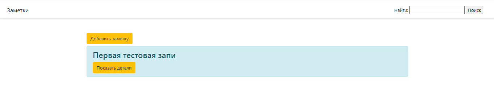
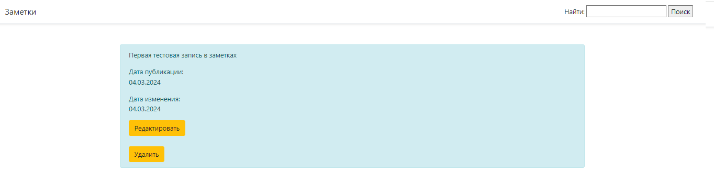
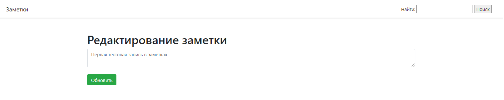
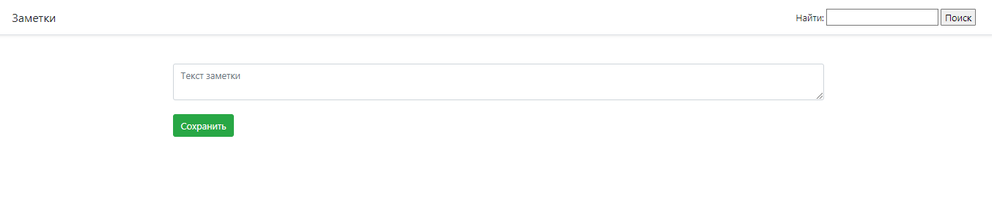

# test_task_notes
Приложение для создания заметок

Приложение предоставляет следующие возможности по работе с заметками:
- вывод списка существующих заметок
- создание нескольких заметок и их сохранение в базу данных
- редактирование заметок
- удаление заметок
- поиск заметки по слову, фразе, содержащихся в тексте заметки

<h2>Необходимые инструменты</h2>

- Java, от 17 версии 
- PostgreSQL, от 12 версии (для запуска из среды разработки)  
- Maven (допускается не ставить, тогда вместо команды ***'mvn'*** надо использовать команду ***'./mvnw'***) 
- Docker

<h2>Запуск проекта</h2>
<h2>1. С помощью среды разработки:</h2>
Перед запуском необходимо в файле application.yml настроить доступ к базе данных -- заполнить поля
***url, username, password***. 
Класс для запуска приложения -
***[Application.java](./src/main/java/com/krd/TestTaskNotes/Application.java)***

<h2>2. С помощью Docker:</h2>
Перед запуском необходимо запустить Docker на рабочем месте.
- В корневой папке проекта (../test_task_notes) открыть терминал 
- Собрать проект с помощью команды ***'./mvnw clean package'***
- Собрать образ приложения командой ***'docker build -t test_task_notes .'***
- Запустить контейнер командой ***'docker-compose up'*** 
Остановить контейнер командой Ctrl + C.

<h2>Главная страница web-приложения</h2>
Главная страница запускается в браузере по
адресу - ***[localhost:8080/api/v1/](http://localhost:8080/api/v1/)*** 

В проекте используется миграция Flyway, поэтому
после запуска по умолчанию в базе данных будет 1 заметка.

На главной странице отображается
список всех заметок. 

Записи расположены в порядке добавления (новая заметка сверху). При редактировании заметки 
она переносится в начало списка, как новая. 

При отображении списка у заметок выводится превью из первых 20 символов. 

Нажимая кнопку "Показать детали" на заметке,
открывается страница, отображающая название содержание, 
дату публикации, дату изменения,
а также кнопки
"Редактировать" и "Удалить".

Кнопка "Удалить" удаляет заметку и
переадресовывает на главную страницу.

Кнопка "Редактировать" переадресовывает
на страницу с формой редактирования заметки.
После нажатия кнопки "Обновить" происходит обновление
заметки и переход на главную страницу.

При нажатии кнопки "Добавить заметку" открывается
страница с формой для записи текста заметки.
При нажатии кнопки "Сохранить" заметка будет добавлена
и откроется главная страница. 

При вводе в строке поиска текста и нажатии кнопки
"Поиск" выдается список заметок, удовлетворяющих условию поиска,
либо пустая страница, если ничего не найдено.
При пустом значении в строке поиска выводится весь список заметок.
Поиск осуществляется по тексту в заметке.

